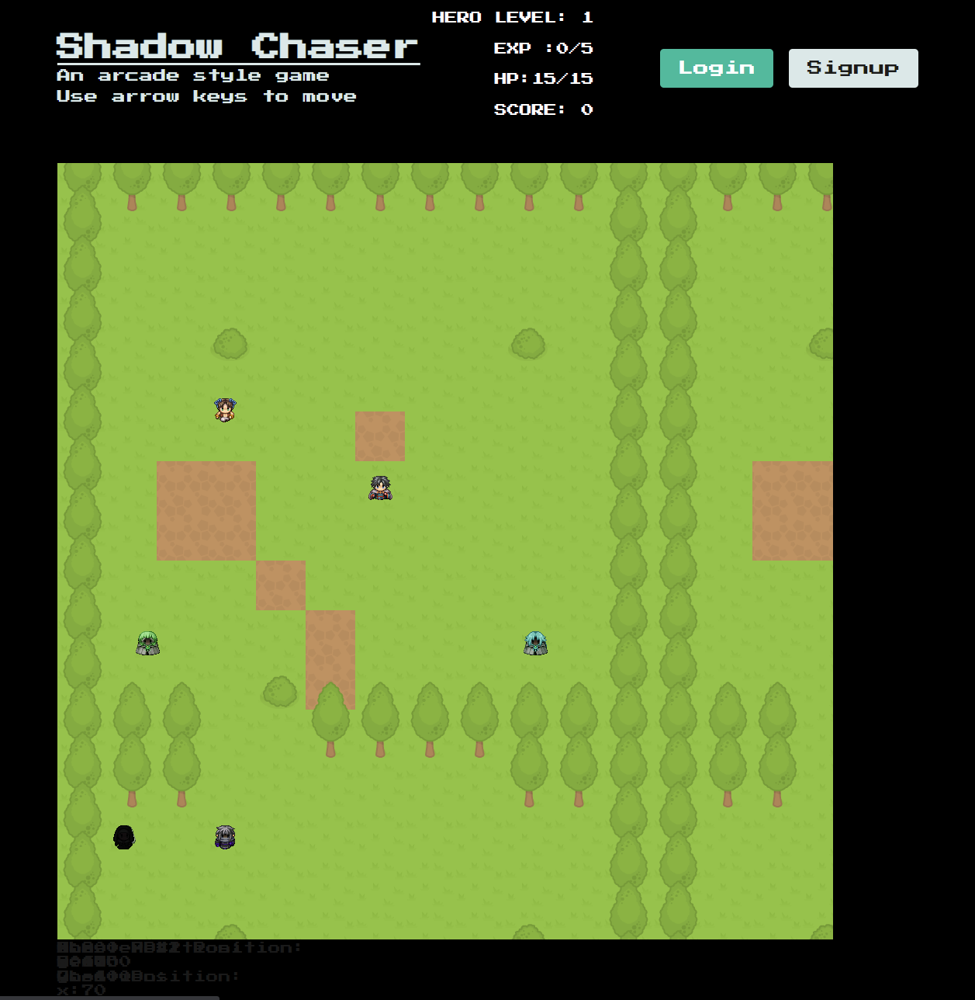

# Shadow-Chaser

# Table of Contents

- [Description](#description)
- [Installation](#installation)
- [Usage](#usage)
- [Instructions](#instructions)
- [Credits_and_Contribution](#Credits_and_Contribution)
- [Contact](#contact)

## Description:
    Shadow Chaser is a full stack MERN application. The video game allows the user to control a player character, as well as their ghost. By using the arrow keys the user can move the player and ghost across the screen. While moving across the screen the player and ghost may come into contact with NPC characters or monsters. The main playable character takes one damage, minus one HP, per collision with monster, and heals for a portion of their HP on contact with NPCs. The ghost character adds one exp to the player, allowing them to level up. The user must simultanously watch their player's location as well as their ghost's, in order to remain alive and level up respectively. Their total exp gained / ghost collisions with monsters is saved to the screen via the their score. When HP reaches zero, the page refreshes and the game is reset. There is also user log in and sign up functionality, which will be used for future development.

## Installation:
    If cloning the repo down locally, ensure all dependencies are installed. Use command " npm start" on the root of the folder to run the application. 

## Usage
    Link to Heroku deployment:
    https://shadow-chaser-an-arcade-game.herokuapp.com/

    Image of Deployed application:
    

## Instructions
    Follow installation instructions.

    If using the application via the deployment on Heroku: use arrow keys to move the character around. 

## Credits and Contribution
    - Jack H. Ault
    - https://github.com/henlowgg

## Contact:
    - For any questions please reach out to me via my GitHub page:

    - [Github Profile](https://github.com/yinzhedy)

    - For any other questions you might have please reach out to me via E-mail at: yinzhe.dy@gmail.com